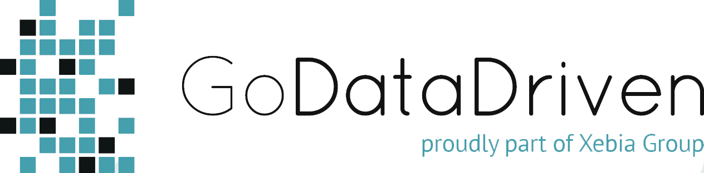
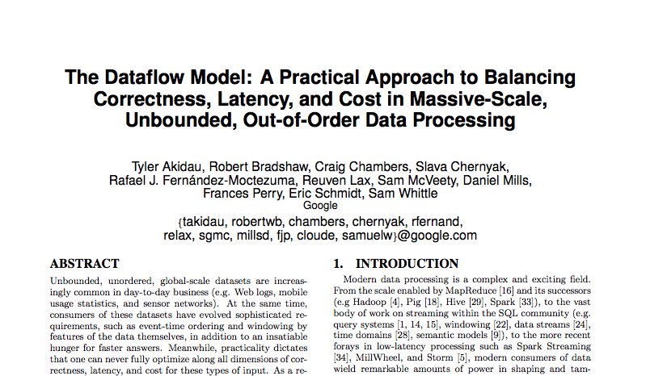
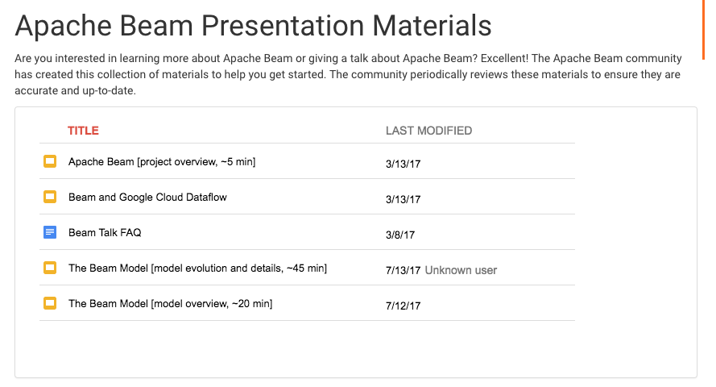
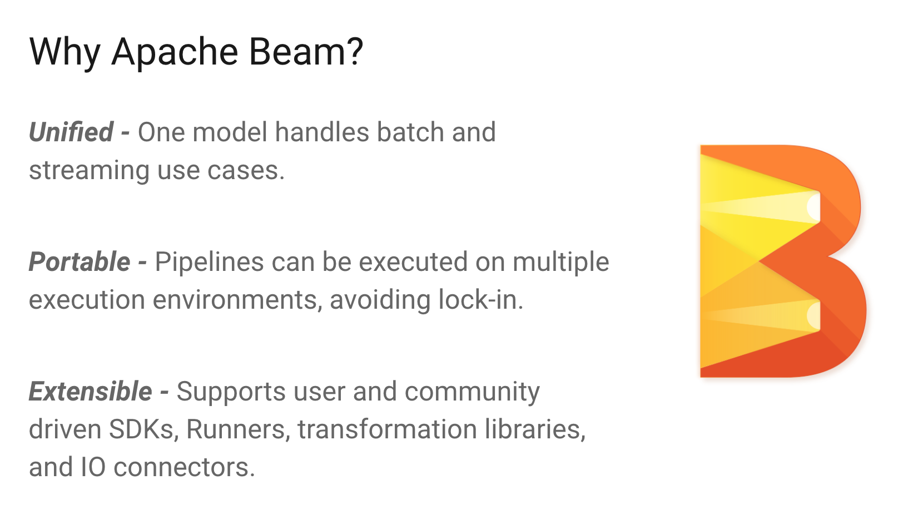
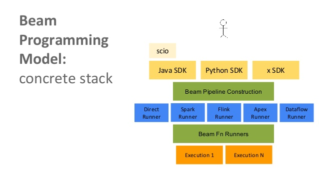
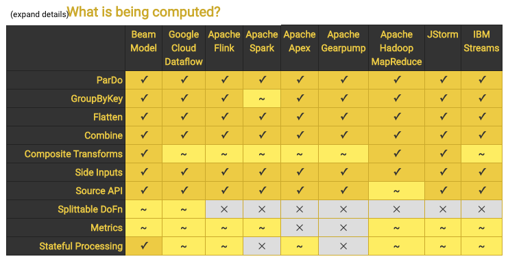
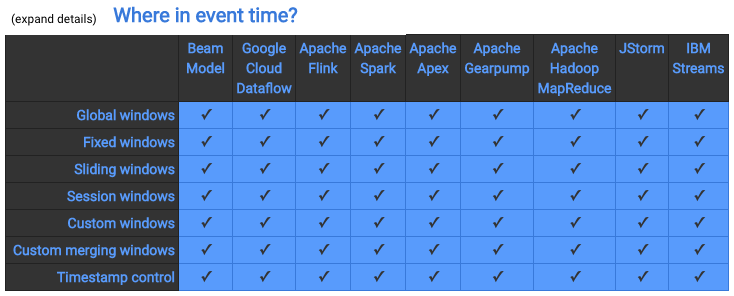
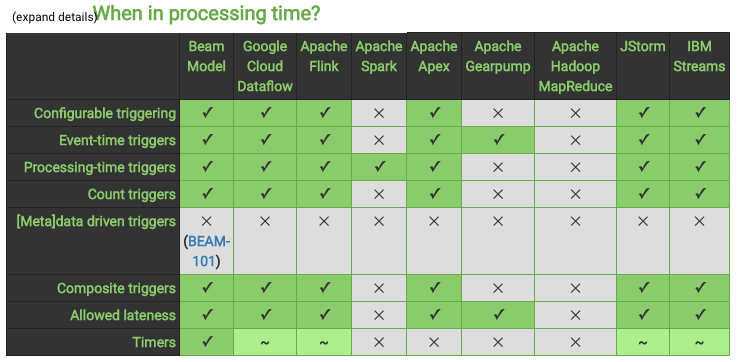
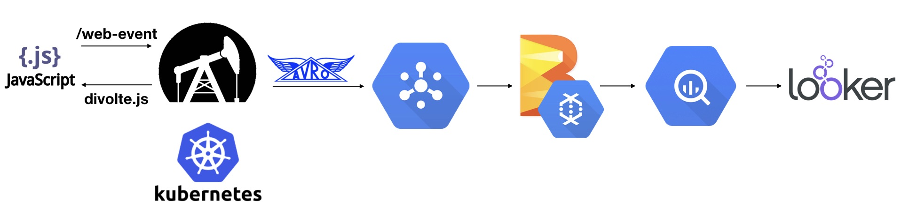
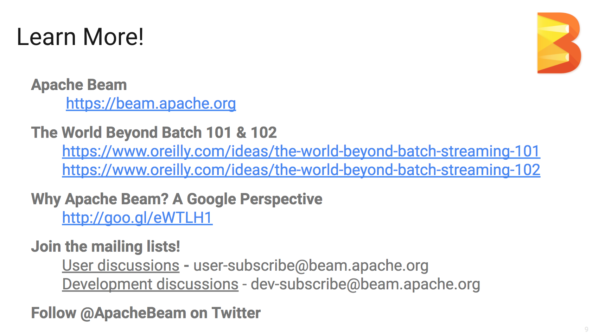

# Apache Beam 101

## B(atch&Str)eam


## And some {Data,Air}flow!

---



# Questions?

- Fokko Driesprong
- github.com/fokko
- fokko@apache.org

---

# Brief history

- Dataflow paper in Sept 2015
- Apache Beam started June 2016
- Jan 2017 Top-level Apache project
- May 2017 First stable Beam release

---



[.footer: https://research.google.com/pubs/pub43864.html]

---



[Google Beam model](https://docs.google.com/presentation/d/17eq17-4KYvF1-2sCOo0sSUdm6gj4h6sWLhLDUYOe1cU/edit#slide=id.g11bcfc06a9_0_0)

Kindly borrowed from: https://beam.apache.org/contribute/presentation-materials/

---



[.footer: https://docs.google.com/presentation/d/1Tc9MdXTDicb6jVCrXjsCbbnLYQCxYiKlTYdVpRkYdBQ/edit#slide=id.g11bc974ad8_0_33]

---



[.footer: https://www.slideshare.net/Wikier/introduction-to-apache-beam-incubating-datacamp-salzburg-7-dec-2016]

---



---



---



---

```java
// Collection of raw log lines
PCollection<AvroMessage> raw = AvroIO.read(...);

PCollection<AvroMessage> rawWithTimestamp = raw.apply(
   WithTimestamps.of((SerializableFunction<AvroMessage, Instant>) record -> new Instant(parseTimestamp(record))
)

Collection<String> windowed = rawWithTimestamp.apply(
Window.<AvroMessage>into(
   FixedWindows.of(Duration.standardMinutes(WINDOW_IN_MINUTES))
).triggering(Repeatedly.forever(AfterWatermark.pastEndOfWindow()))
 .discardingFiredPanes()
 .withAllowedLateness(Duration.standardDays(1))
);

// Element-wise transformation into team/score pairs
PCollection<KV<String, Integer>> input = raw.apply(ParDo.of(new ParseFn());

// Composite transformation containing an aggregation
PCollection<KV<String, Integer>> scores = input.apply(Sum.integersPerKey());

IO.Write<TableRow>.write(scores);
```

[.footer: https://docs.google.com/presentation/d/1SHie3nwe-pqmjGum_QDznPr-B_zXCjJ2VBDGdafZme8/edit#slide=id.g12846a6162_0_4571]

---

# Event Collection
## on the Google Cloud


---


---


# Volumes
- ~10k requests per second
- ~1m unique visitors per day
- ~120m records per day
- Highly dynamic

---

# Part of the landscape




---

# Divolte


- Crazy fast, open source, event collector

```javascript
divolte.signal('searchResultClick', {
    productId: 309125,
    searchPhrase: 'sneakers'
})
```
- Apache Avro (with schema evolution)
- HDFS, Kafka, GCS and GCPS sink
- Created by Andrew & Friso

---


# Dataflow runner on GCP

- [Link](https://console.cloud.google.com/dataflow?project=mit-reporting-prod-1)
- System lag
- Wall clock time
- Autoscaling
- Writes to BigQuery

---


[Looker](https://looker.npo-data.nl/dashboards/73?Datum%2Ftijd=180%20minutes&Portaal=npoportal&filter_config=%7B%22Datum%2Ftijd%22:%5B%7B%22type%22:%22past%22,%22values%22:%5B%7B%22constant%22:%22180%22,%22unit%22:%22min%22%7D,%7B%7D%5D,%22id%22:4%7D%5D,%22Portaal%22:%5B%7B%22type%22:%22%3D%22,%22values%22:%5B%7B%22constant%22:%22npoportal%22%7D,%7B%7D%5D,%22id%22:5%7D%5D%7D)

---


---


# Apache Airflow

- Developed by Airbnb in 2015
- Programatically workflow scheduling
- {ETL, Machine Learning, Predictive, General} pipeline
- Great Google Cloud integration
- [Link](https://airflow.gcp.npo-data.nl/admin/airflow/tree?dag_id=avro_to_bigquery)

---

```java
if (options.isStreaming()) {
    final String subscription = options.getSubscription();
    source = pipeline
        .apply(
            "ReadFromSubscription: " + subscription,
            PubsubIO.readAvros(NpoEventRecord.class)
                    .fromSubscription(subscription)
        );
} else {
    final ArrayList<PCollection<NpoEventRecord>> pcollectionlist = new ArrayList<>();

    final String[] paths = options.getGcsPath().split(",");
    for (final String path : paths) {
        PCollection<NpoEventRecord> extra = pipeline.apply(
            "ReadFromGcsPath",
            AvroIO.read(NpoEventRecord.class)
                  .from(path)
        );
        pcollectionlist.add(extra);
    }
    final PCollectionList<NpoEventRecord> tempRes = PCollectionList.of(pcollectionlist);
    source = tempRes.apply(Flatten.pCollections());
}
```

---



[.footer: https://docs.google.com/presentation/d/1Tc9MdXTDicb6jVCrXjsCbbnLYQCxYiKlTYdVpRkYdBQ/edit#slide=id.g11bc974ad8_0_33]
