footer: © GoDataDriven, Fokko Driesprong(@godatadriven.com), @fokkodriesprong


# Cost effective Druid

## \n
## \n


---


# Whoami

- Master Distributed Systems & Software Engineering
- Apache PPMC Member and Apache Airflow committer
- Contributer to Apache Flink, Apache Spark, Druid and more

---


# GoDataDriven

- Consultancy company
- Amsterdam based
- Always on the lookout for Data Engineers

---


# Mobpro

- AdTech company
- Buys ad-space for campaigns
- Performs RTB on ad-space
- Druid as a Service from Metamarkets

---


# Druid

- Developed by Metamarkets
- Open Source Apache 2.0 license
- Druid is a distributed, column-oriented, real-time analytics data store
- Optimised for sub-second Slice-and-Dice OLAP operations
- Walmart uses Druid for analytics

[.footer: https://medium.com/walmartlabs/event-stream-analytics-at-walmart-with-druid-dcf1a37ceda7]

---

# Druid history

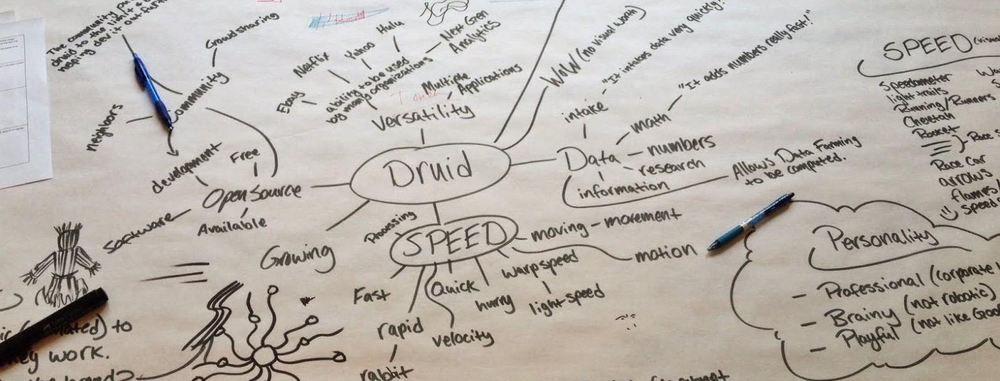

- Developed by Metamarkets in 2011
- Open sourced, GPL 2012, Apache license 2015
- Used by Twitter, AirBnB, Netflix and many more
- Metamarkets got sold to Snap Inc in 2017

[.footer: https://medium.com/engineers-optimizely/slicing-and-dicing-data-with-druid-f61cca8a63d2]

---


# Insourcing Druid on OpenStack

Open source software for creating clouds.

- Minimal TCO
- Flexibility

---


# Some numbers

- ~600M requests per day
- ~70GB per day bz2 compressed
- ~400GB per day uncompressed

---

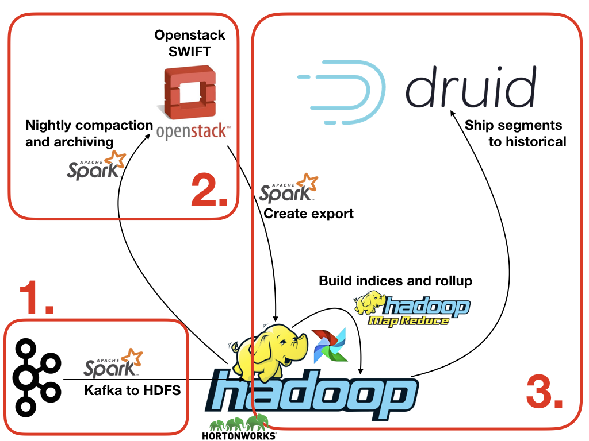

---

# ELT using Spark Streaming

- Spark structured streaming
- Write a LOT of json to hdfs
- Raw strings and fast Snappy compression

---

```
root@hadoopedge01:~# hdfs dfs -ls /data/live/
Found 10 items
drwxr-xr-x   - hdfs hdfs          0 2018-02-15 19:57 /data/live/_spark_metadata
drwxr-xr-x   - hdfs hdfs          0 2018-02-15 05:11 /data/live/topic=bids
drwxr-xr-x   - hdfs hdfs          0 2018-02-15 05:11 /data/live/topic=events
drwxr-xr-x   - hdfs hdfs          0 2018-02-15 05:11 /data/live/topic=interaction_1
drwxr-xr-x   - hdfs hdfs          0 2018-02-15 05:11 /data/live/topic=interaction_2
drwxr-xr-x   - hdfs hdfs          0 2018-02-15 05:11 /data/live/topic=nobids
drwxr-xr-x   - hdfs hdfs          0 2018-02-15 05:11 /data/live/topic=requested_impressions
drwxr-xr-x   - hdfs hdfs          0 2018-02-15 05:11 /data/live/topic=served_impressions
drwxr-xr-x   - hdfs hdfs          0 2018-02-15 05:11 /data/live/topic=viewable_impressions
drwxr-xr-x   - hdfs hdfs          0 2018-02-15 05:11 /data/live/topic=wins
```

---

```
root@hadoopedge01:~# hdfs dfs -ls -h /data/live/topic=bids/date=2018-02-15 | head -n 10
Found 1610 items
-rw-r--r--   3 hdfs hdfs      7.5 M 2018-02-15 10:45 /data/live/topic=bids/date=2018-02-15/part-00003-01460dad-9cef-4e8f-94a9-77bf5b1623fe.c000.txt.snappy
-rw-r--r--   3 hdfs hdfs      6.7 M 2018-02-15 10:20 /data/live/topic=bids/date=2018-02-15/part-00003-02b57165-cb4a-44af-a12a-b08adeffa880.c000.txt.snappy
-rw-r--r--   3 hdfs hdfs      7.6 M 2018-02-15 10:05 /data/live/topic=bids/date=2018-02-15/part-00003-02bcd4bd-618e-43c9-9c3e-93b3f99004e5.c000.txt.snappy
-rw-r--r--   3 hdfs hdfs      9.7 M 2018-02-15 18:20 /data/live/topic=bids/date=2018-02-15/part-00003-0450853b-042e-4c1a-8e08-c45524e9dfb1.c000.txt.snappy
-rw-r--r--   3 hdfs hdfs      7.4 M 2018-02-15 10:50 /data/live/topic=bids/date=2018-02-15/part-00003-066b49f7-a79a-4a30-8031-82b07414a5c4.c000.txt.snappy
-rw-r--r--   3 hdfs hdfs      8.6 M 2018-02-15 08:00 /data/live/topic=bids/date=2018-02-15/part-00003-0806973a-53c4-4fa1-ae77-6d0dac8b6503.c000.txt.snappy
-rw-r--r--   3 hdfs hdfs      7.5 M 2018-02-15 10:55 /data/live/topic=bids/date=2018-02-15/part-00003-0836b8a1-c172-4f91-9782-2e15ceaa76cb.c000.txt.snappy
-rw-r--r--   3 hdfs hdfs     28.9 M 2018-02-15 19:03 /data/live/topic=bids/date=2018-02-15/part-00003-0aaead9c-1486-43b7-8551-d490528e0dce.c000.txt.snappy
-rw-r--r--   3 hdfs hdfs      7.8 M 2018-02-15 11:05 /data/live/topic=bids/date=2018-02-15/part-00003-0b98db4e-8ba0-4501-a8c6-70caa8040481.c000.txt.snappy
```

---

# Poor compression

```
root@hadoopedge:~# hdfs dfs -du -s -h /tmp/compressiontest/*
4.7 G  /tmp/compressiontest/bzip2, ratio 5.65957447
9.6 G  /tmp/compressiontest/lz4, ratio 2.77083333 
26.6 G  /tmp/compressiontest/none, ratio 1.0
10.6 G  /tmp/compressiontest/snappy, ratio 2.50943396 
```

---


---

# SWIFT as Storage (TCO)

## Openstack platform

- 225€ per TB normal volumes (inc. replication)
- 50€ per TB SWIFT object storage
- 23$ per TB at Amazon S3

---

# SWIFT support by Spark :smile:

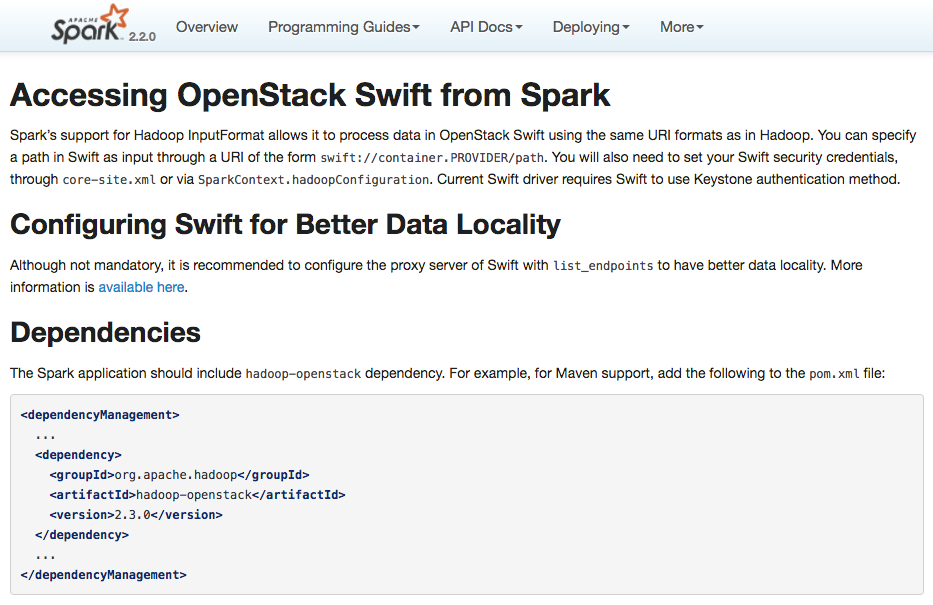

---

# Bad news :unamused:

```
Caused by: java.net.SocketTimeoutException: COPY https://intern...0a2acc3577a-c000.json failed on exception: ...
    java.net.SocketTimeoutException: Read timed out; For more details see:  http://wiki.apache.org/hadoop/SocketTimeout
at sun.reflect.NativeConstructorAccessorImpl.newInstance0(Native Method)
at sun.reflect.NativeConstructorAccessorImpl.newInstance(NativeConstructorAccessorImpl.java:62)
at sun.reflect.DelegatingConstructorAccessorImpl.newInstance(DelegatingConstructorAccessorImpl.java:45)
at java.lang.reflect.Constructor.newInstance(Constructor.java:423)
at org.apache.hadoop.fs.swift.http.ExceptionDiags.wrapWithMessage(ExceptionDiags.java:90)
at org.apache.hadoop.fs.swift.http.ExceptionDiags.wrapException(ExceptionDiags.java:76)
... 22 more
Caused by: java.net.SocketTimeoutException: Read timed out
at java.net.SocketInputStream.socketRead0(Native Method)
at java.net.SocketInputStream.socketRead(SocketInputStream.java:116)
... 27 more
```

---

# To the dark side


---

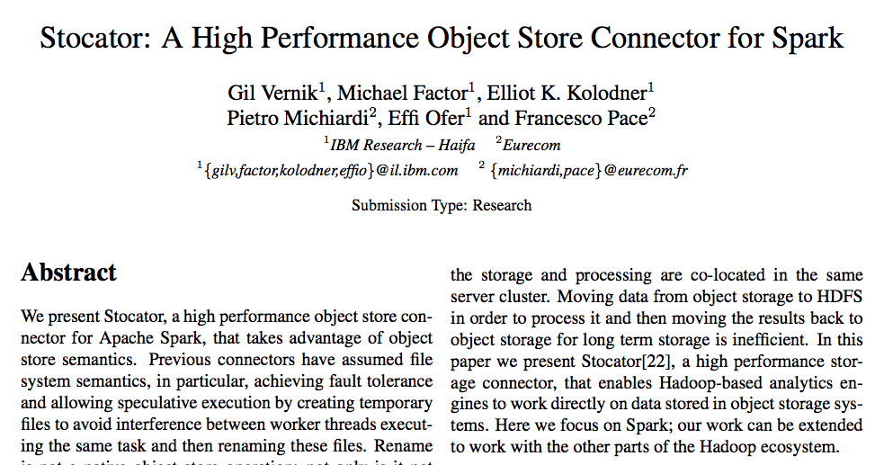

[.footer: https://arxiv.org/pdf/1709.01812.pdf]

---

# No rename :thumbsup:

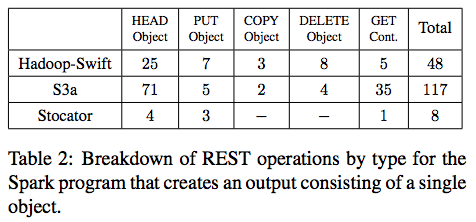

[.footer: https://arxiv.org/pdf/1709.01812.pdf]

---

# Still not happy :sob:

```
[13/Dec/2017:23:12:12 +0000] 408 - "PUT https://../part-00022.json.bz2" "tx67f0c939e070417aad7e8-005a31b390" 60.0027
```

## 408 Request Timeout, why?

---

# Steps of writing Parquet

- First write the magic `PAR1`
- Then write the schema
- Finally write the actual content

### In a busy environment..

---

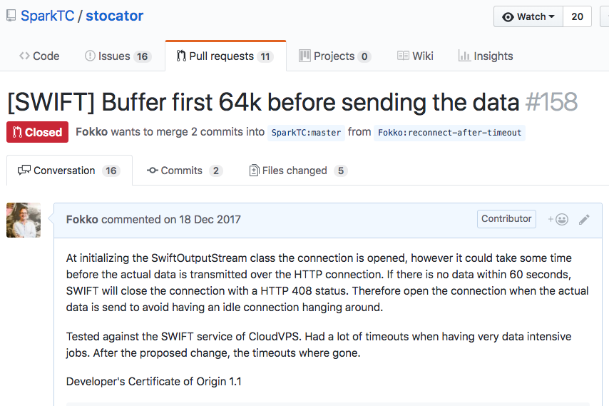

[.footer: https://github.com/SparkTC/stocator/pull/158]

---

# Writing works, but after reading

```
scala> val data = "Very long string"

scala> val arr = data.split(" ")
arr: Array[String] = Array( "Very", "long", "string" )

scala> val distData = sc.parallelize(arr)
distData: org.apache.spark.rdd.RDD[String] = ParallelCollectionRDD[0] at parallelize at <console>:28

scala> val df = distData.toDF("word")
df: org.apache.spark.sql.DataFrame = [word: string]

scala> df.write.option("compression", "bzip2").json("swift2d://druid.mobpro/test-append/")

scala> spark.read.json("swift2d://druid.mobpro/test-append/").show()
+--------------------+
|     _corrupt_record|
+--------------------+
|BZh91AY&SY�{ƸK]...|
+--------------------+
```

---

# Invalid extension of the filenames :sob:

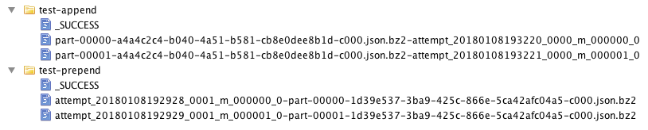

---

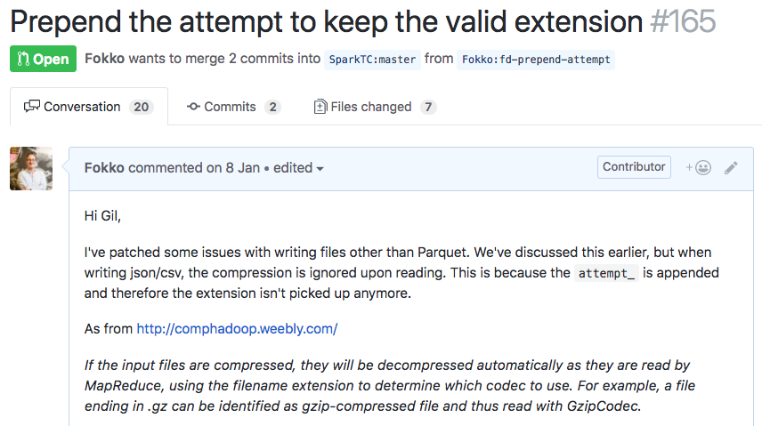

[.footer: https://github.com/SparkTC/stocator/pull/165]

---


---

# Druid on SWIFT?

- Rackspace Cloudfiles plugin
- Seems unmaintained
- Druid data is small anyway

---

# Roll-up of data

```
timestamp             publisher          advertiser  gender  country clicks price
2011-01-01T01:01:35Z  bieberfever.com    google.com  Male    USA     0      0.65
2011-01-01T01:03:63Z  bieberfever.com    google.com  Male    USA     0      0.62
2011-01-01T01:04:51Z  bieberfever.com    google.com  Male    USA     1      0.45
2011-01-01T01:00:00Z  ultratrimfast.com  google.com  Female  UK      0      0.87
2011-01-01T01:00:00Z  ultratrimfast.com  google.com  Female  UK      1      0.99
2011-01-01T01:00:00Z  ultratrimfast.com  google.com  Female  UK      1      1.53

Roll-up:

timestamp             publisher          advertiser  gender  country clicks price
2011-01-01T01:04:51Z  bieberfever.com    google.com  Male    USA     1      1.72
2011-01-01T01:00:00Z  ultratrimfast.com  google.com  Female  UK      2      3.39
```

Configurable on index time

---

# One day of Bids data

```
root@hadoopedge01:/tmp/druid#hdfs dfs -get /druid/data/datasources/Bids/20171211.../0_index.zip /tmp/druid
root@hadoopedge01:/tmp/druid# unzip 0_index.zip
root@hadoopedge01:/tmp/druid# ls -lah
total 712M
drwxr-xr-x  3 root root 4.0K Jan 22 11:00 .
drwxrwxrwt 31 root root 4.0K Jan 22 11:00 ..
-rw-r--r--  1 root root 452M Jan 22 12:17 00000.smoosh
-rw-r--r--  1 root root 261M Jan 22 11:00 0_index.zip
drwxr-xr-x  3 root root 4.0K Jan 22 10:58 20171211T000000.000Z_20171212T000000.000Z
-rw-r--r--  1 root root   29 Jan 22 12:17 factory.json
-rw-r--r--  1 root root 2.3K Jan 22 12:17 meta.smoosh
-rw-r--r--  1 root root    4 Jan 22 12:17 version.bin
```

### About 1% of the original (decompressed)

---

# Roll-up in Superset

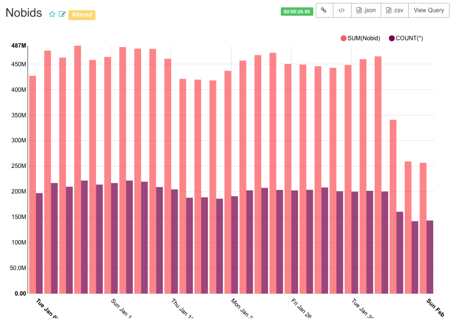

---


---


# Update schema and reindex the data

# Airflow to the rescue

- Monitor the indexing process
- Changes to the Druid schema
- Easy rebuilding of the data

---


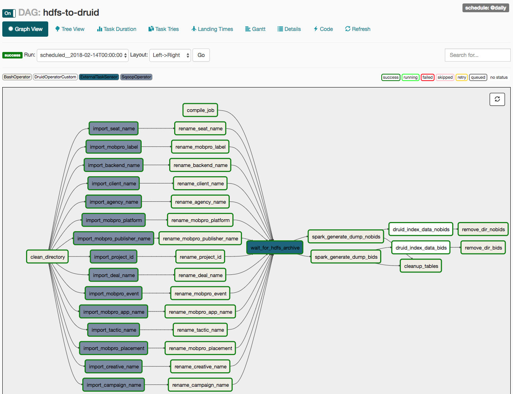

---


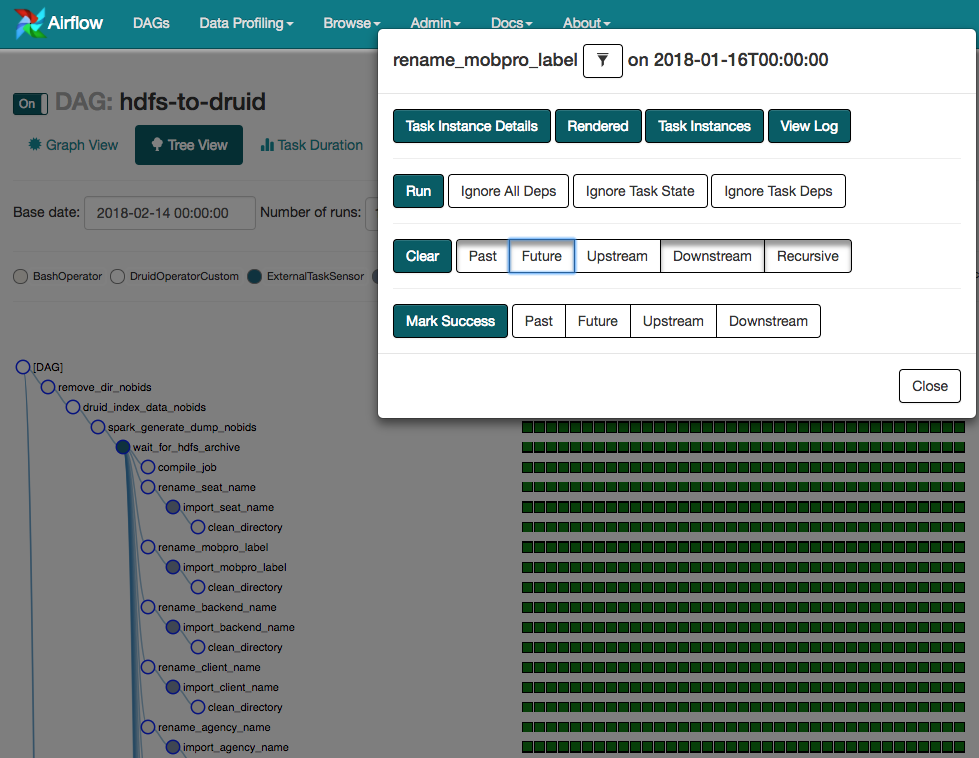

---

# Future music :musical_note:

- Ingesting on Spark
- Replace Sqoop by SparkJDBC
- Add streaming ingestion

---

# Thank you for your attention

### Any questions?


