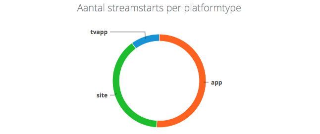

footer: © GoDataDriven, Fokko Driesprong(@godatadriven.com), @fokkodriesprong

# Event Collection
## on the Google Cloud


---


# Whoami

- Master Distributed Systems & Software Engineering
- Apache PPMC Member and Apache Airflow committer
- Contributor to Apache Flink, Apache Spark, Apache Druid and more

---


# GoDataDriven

- IT Consultancy company
- Data Engineering and Science
- Open source minded

---


---


---


---


---

# Events coming from:




---


# Volumes
- ~10k requests per second
- ~1m unique visitors per day
- ~120m records per day
- Highly dynamic

---

# Divolte


- Crazy fast, open source, event collector

```javascript
divolte.signal('searchResultClick', {
    productId: 309125,
    searchPhrase: 'sneakers'
})
```
- Apache Avro (with schema evolution)
- HDFS, Kafka, GCS and GCPS sink
- ip2geo Lookup

---


---

# Rolling updates


---


# Try it yourself

- Examples and documentation: Divolte.io
- Docker: https://hub.docker.com/r/godatadriven/divolte/
- Proof of concept: https://blog.godatadriven.com/divolte-kafka-druid-superset

---


---


# Dataflow

- Consume Avro
- Remove corrupted/duplicates
- Run aggregations
- Push to Bigquery

---

# Dataflow CI

- Run: PMD, FindBugs, Unit-test 
- Jenkins builds new jar and deploys on staging
- If ok, deploy on production

```
java -jar ./build/libs/raw-aggregations.jar  \
                --jobName=${job}  \
                --runner=DataflowRunner  \
                --project=${project}  \
                --region=europe-west1  \
                --streaming=true  \
                --workerMachineType=n1-standard-8  \
                --maxNumWorkers=8  \
                --subscription=${subscription}  \
                --update=true \
                --autoscalingAlgorithm=THROUGHPUT_BASED
```


---


---


---


---


---


---


# Apache Airflow

- Developed by Airbnb in 2015
- Programatically workflow scheduling
- {ETL, Machine Learning, Predictive, General} pipeline
- Great Google Cloud integration
- Used by 150+ companies, including Airbnb, ING, LinkedIn, Paypal
- ~350 contributors

---


---


---


---

# Next steps

- Running Spark on Kubernetes
- Faster feedback using Dataflow
- Apache Airflow on Kubernetes


---

# Thank you for your attention

## Time for questions!