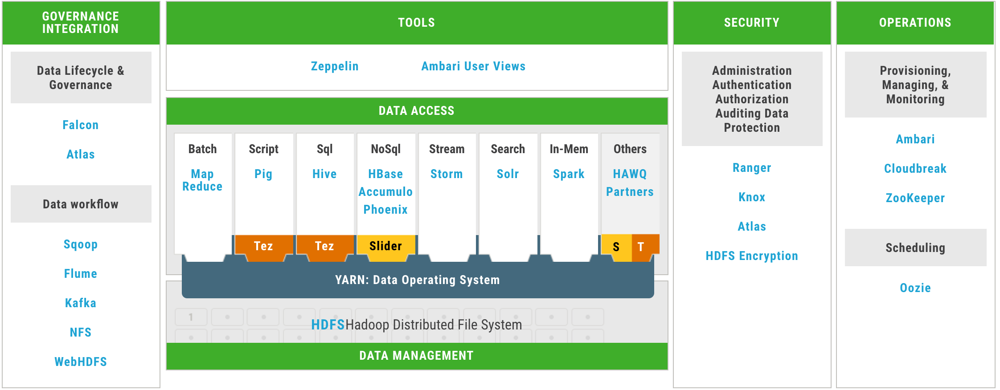
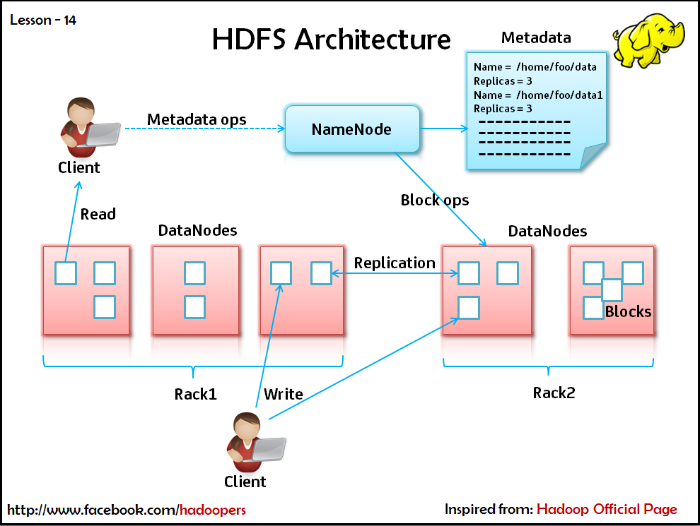
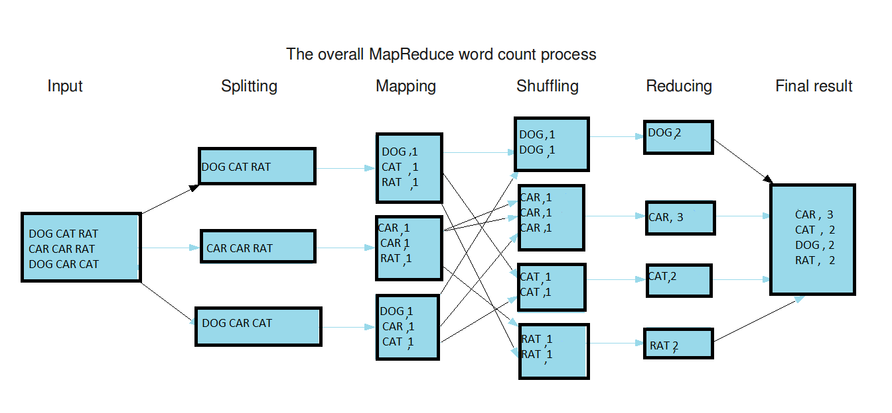
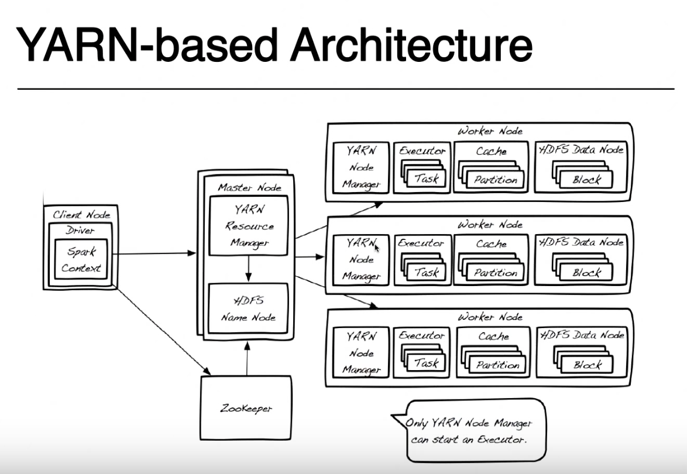
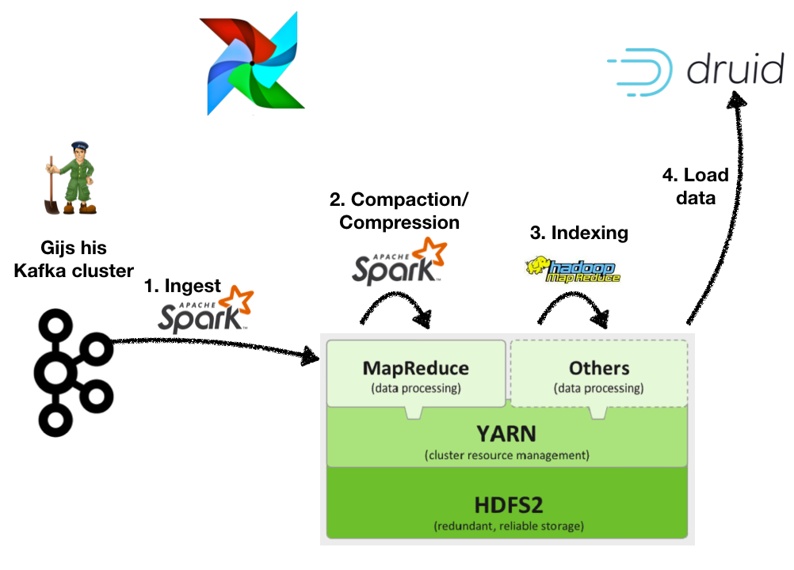
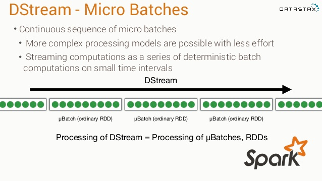
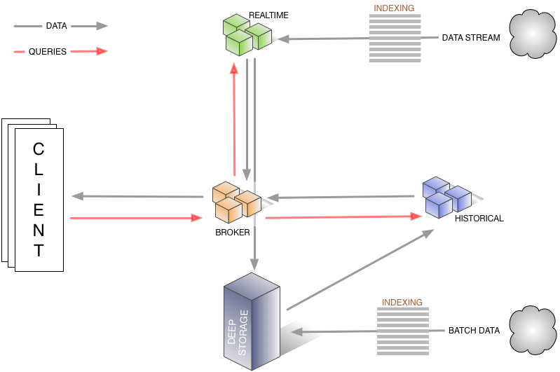
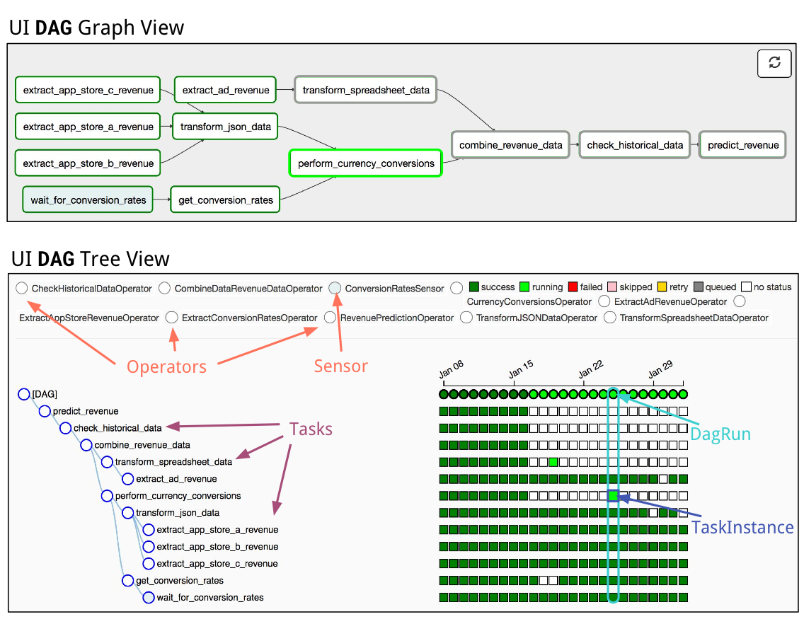

# Hadoop 101 :elephant:

### Fokko Driesprong
### GoDataDriven

---

## What is Hadoop?

- The Apache™ Hadoop® project develops open-source software for reliable, scalable, distributed computing.

- Core: HDFS, Yarn, MapReduce

- Extensions: ZooKeeper, HBase, Spark, Tez, Avro, Cassandra and many more

---

# Hadoop history

- Hadoop based on Google File System (2003) https://research.google.com/archive/gfs.html
- Mapreduce based on Google MapReduce model (2004) https://static.googleusercontent.com/media/research.google.com/en//archive/mapreduce-osdi04.pdf

---

# How do we work with it

Possibilities:
- Provision your own machines
- Take an open source distribution (Cloudera, Hortonworks, MapR, EMR, Dataproc etc)

---

# Hortonworks Data Platform (HDP)

---

# HFDS

---

# Mapred

---

# YARN

---

# Process

---

# 1. ETL

---

# 1.1 ETL

---

# 3. Indexing

---

# 3. Airflow

