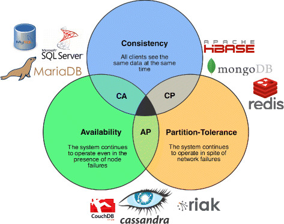

---


# Whoami

- Master Distributed Systems & Software Engineering
- Apache PPMC Member and Apache Airflow committer
- Contributer to Apache Flink, Apache Spark, Apache Druid (incubating) and more

---


# GoDataDriven

- Consultancy company
- Amsterdam based
- ~30 scientists/engineers
- Hiring

---


# Druid (Apache Incubating)

- Metamarkets for ad-tech
- Druid is distributed, column-oriented and real-time
- Optimised for sub-second Slice-and-Dice OLAP operations
- Competes with Snowflake, BigQuery, Redshift etc
- Walmart uses Druid for analytics
- Ships with Hortonworks Data platform

[.footer: https://medium.com/walmartlabs/event-stream-analytics-at-walmart-with-druid-dcf1a37ceda7]

---


---

# Druid history


- Developed by Metamarkets in 2011
- Open sourced, GPL 2012, Apache 2.0 license 2015
- Used by Twitter, AirBnB, Netflix and many more
- Metamarkets sold to Snap Inc in 2017
- February 2018 Apache Incubating

[.footer: https://medium.com/engineers-optimizely/slicing-and-dicing-data-with-druid-f61cca8a63d2]

---



---

# Availabilty / Partition-tolerance

- No support for updates
- Immutable segments of data
- Partitioned on time dimension
- Configurable granulairty (day, hour, minute, etc)

---

# Inserting data

- Streaming
  - Pull from Kafka
  - Push using tranquility
- Batch ingesting
  - Using Mapreduce

---

# Querying data

- Using SQL
  - Introduced in 0.10.0
- Using JSON
  - Timeseries, TopN, GroupBy

---


---


---


---


# Deepstore

- Highly available storage for Data+Indices
- HDFS, S3, etc
- Share nothing
- Scaling up/down

---


---


# Historical node

- Receives a list of segments from the coordinator
- Pulls segments from the deep store
- Processing of the segments
- Loves SSD's

---


---


# Broker node

- Answers to queries
- Merges the results from the historical nodes
- Loves (lots of) RAM

---


---


# Coordinator node

- One in the whole cluster
- Manages the segments
- Balances the cluster

---


---


# Realtime node

- Buffer messages from Kafka/Tranquility
- Periodically write segments to Deepstore
- Run queries on in-memory data
- Optional

---


---


# External dependencies

- Postgres/Mysql as metadata store
- Zookeeper for communication

---


# Mobpro

- AdTech company
- Buys ad-space for campaigns
- Performs RTB on ad-space
- Druid as a Service from Metamarkets

---


# Insourcing Druid on OpenStack

Open source software for creating clouds.

- Minimal TCO
- Flexibility

---


# Some numbers

- ~600M requests per day
- ~400GB per day uncompressed
- ~70GB per day compressed (bz2)
- All in JSON

---


---

# Roll-up of data

```
timestamp             publisher          advertiser  gender  country clicks price
2011-01-01T01:01:35Z  bieberfever.com    google.com  Male    USA     0      0.65
2011-01-01T01:03:63Z  bieberfever.com    google.com  Male    USA     0      0.62
2011-01-01T01:04:51Z  bieberfever.com    google.com  Male    USA     1      0.45
2011-01-01T01:00:00Z  ultratrimfast.com  google.com  Female  UK      0      0.87
2011-01-01T01:00:00Z  ultratrimfast.com  google.com  Female  UK      1      0.99
2011-01-01T01:00:00Z  ultratrimfast.com  google.com  Female  UK      1      1.53

Roll-up:

timestamp             publisher          advertiser  gender  country clicks price
2011-01-01T01:00:00Z  bieberfever.com    google.com  Male    USA     1      1.72
2011-01-01T01:00:00Z  ultratrimfast.com  google.com  Female  UK      2      3.39
```

Configurable on index time

---

# Roll-up in Superset


---

# One day of Bids data

```
root@hadoopedge01:/tmp/druid# hdfs dfs -get /druid/datasources/Bids/20171211.../0_index.zip /tmp/druid
root@hadoopedge01:/tmp/druid# unzip 0_index.zip
root@hadoopedge01:/tmp/druid# ls -lah
total 712M
drwxr-xr-x  3 root root 4.0K Jan 22 11:00 .
drwxrwxrwt 31 root root 4.0K Jan 22 11:00 ..
-rw-r--r--  1 root root 452M Jan 22 12:17 00000.smoosh
-rw-r--r--  1 root root 261M Jan 22 11:00 0_index.zip
drwxr-xr-x  3 root root 4.0K Jan 22 10:58 20171211T000000.000Z_20171212T000000.000Z
-rw-r--r--  1 root root   29 Jan 22 12:17 factory.json
-rw-r--r--  1 root root 2.3K Jan 22 12:17 meta.smoosh
-rw-r--r--  1 root root    4 Jan 22 12:17 version.bin
```

#### About 1% of the original (decompressed)

---

# What are they using it for?

- What is the price for adspace throughout the day? For a specific domain.
- If we would do Campaign X, how many people can we reach?
- What is the geographic reach of this campaign?
- Shoot, we're missing a dimension

---


# Update schema and reindex the data

---


# Apache Airflow to the rescue

- Developed by Airbnb in 2015
- CRON on steroids
- {ETL, Machine Learning, Predictive, General} pipeline

---


# Airflow + Druid = :hearts:

- Monitors the Druid indexing process
- Easy rebuilding of the Druid indices

---


---


---


# Cool stuff
## I want to give it a try

---


# Open source activity

- Ansible scripts to set up Druid on AWS
- https://github.com/godatadriven/druid-ansible
- Thanks Kris!

---


# Open source activity

- Scala + Druid = Scruid
- Typesafe Druid
- In collaboration with the ING WBAA
- https://github.com/ing-bank/scruid
- Thanks Bas!

---

# Time for a demo

- Blogpost: Real time analytics: Divolte + Kafka + Druid + Superset
- Divolte event collector
- https://blog.godatadriven.com/divolte-kafka-druid-superset

---


---


# Open source activity?

- Build indices on Apache Spark
- Druid on Kubernetes

---

# That's it

### Any questions?
